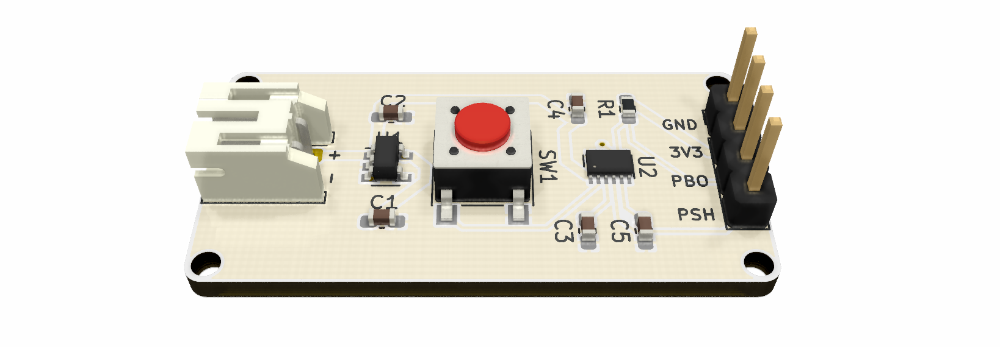
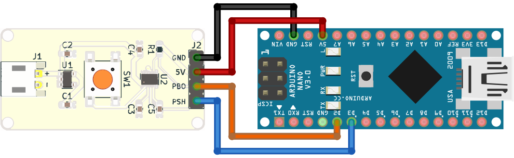

# One Button Interface

PCB layout and schematic and Arduino code for a single push-button interface that can be used to turn a device on/off as well as a user input to interact with the firmware on a microcontroller.

## BOM

Reference   | Quantity| Value                                                                       | RS Stock No.| Vendor
|-          |-        |-                                                                            |-            |-
C1 C2 C3 C5 |4        |1uF                                                                          |461-2708     |RS
C4          |1        |0.1uF                                                                        |264-4630     |RS
H1 H2 H3 H4 |4        |MountingHole                                                                 |~
J1          |1        |[Conn_01x02](https://docs.rs-online.com/cb9d/0900766b81347511.pdf)           |820-1494     |RS
J6          |1        |[Conn_01x04](https://docs.rs-online.com/cd6a/0900766b813c4c2e.pdf)           |360-6314     |RS
R1          |1        |10K                                                                          |182-9211     |RS
SW1         |1        |[PTS645SL50SMTR 92 LFS](https://docs.rs-online.com/62d0/0900766b815a8e9b.pdf)|135-9400     |RS
U1          |1        |[LD39015M33R](http://www.st.com/resource/en/datasheet/ld39015.pdf)           |795-8965     |RS
U2          |1        |[STM6600](http://www.st.com/resource/en/datasheet/stm6600.pdf)               |189-2069     |RS

## Directory Tree

- arduino - Arduino source code with an example application.
- img - Supplementary images
- pcb - PCB schematic, layout and BOM.
  - kicad - Design files for KiCad EDA.

## Connection Diagram

